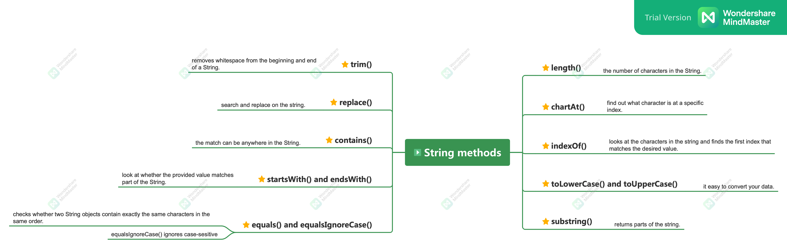

## Concatenation

### Some rules while String concatenation: 
- If both operands are numeric, + means numeric addition.
- If either operand is a String, + means concatenation.
- The expression is evaluated left to right.

```java
    System.out.println(1 + 2); // 3
    System.out.println("a" + "b"); // ab
    System.out.println("a" + "b" + 3); // ab3
    System.out.println(1 + 2 + "c"); // 3c
```
### Immutability
Once a String object is created, it is not allowed to change. It cannot be made larger or
smaller, and you cannot change one of the characters inside it.

### The String Pool
The string pool contains literal values that appear in your program.
Strings not in the string pool are garbage collected just like any other object.


